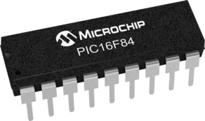

# Embedded software project
This is an embedded software project builded in PIC16F84A 04/P microcontroller using the PICKIT 3 programmer. This project use a 7 segments display to show a number for each combination of inputs. The program was built in assembly language using MPLAB X IDE and charged in the microcontroller with the help of PICKIT 3.

## Development tools
* [Assembly programming language](https://studylib.net/doc/17544481/programming--pic-16f84a-in-assembly)
* [MPLAB X IDE](https://www.microchip.com/en-us/tools-resources/develop/mplab-x-ide)

## Hardware
* [PIC16F84A 04/P](https://www.geekfactory.mx/tienda/componentes/microcontroladores/pic16f84a-microcontrolador-pic-8-bits-microchip/)

